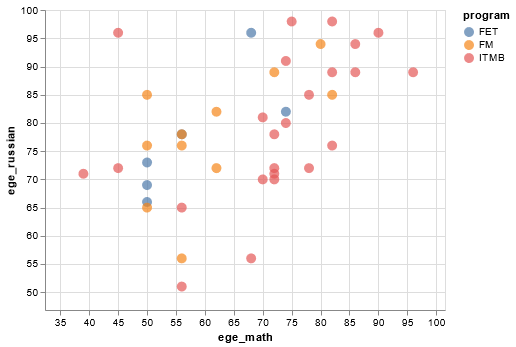

Data:

- school examination scores by subject ("ege_*")

Not provided yet in dataset:

- freshman year grade point average (GPA1) 
- freshman year grade in English of other foreign language 

Pipeline:

- download data from Google sheets
- create clean dataset
- plot visualisations

Questions:

1. Do school scores ("ege") predict average freshman year grade at out faculty? 
2. Is freshman year grade in English predictable? 

